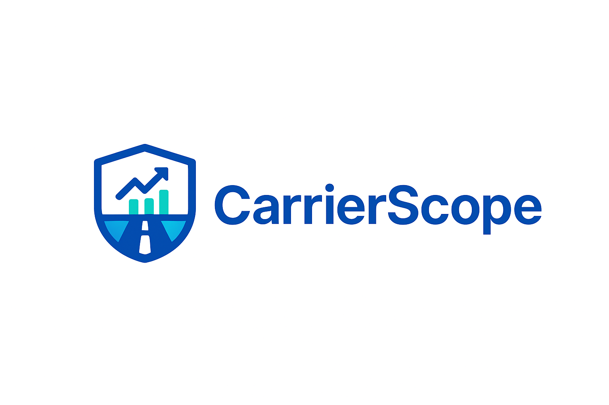

<p align="center">
  
</p>

<p align="center">
  <a href="https://alekseistroev.github.io/CarrierScope" target="_blank">
    
  </a>
</p>

<p align="center">
  
  
  
</p>

---

# CarrierScope  
**Quality Intelligence for Logistics**

CarrierScope is a SaaS platform designed to analyze and monitor the performance of freight brokers and carriers across the U.S.  
It helps logistics companies make data-driven decisions by providing transparency, analytics, and verified community feedback.

---

### 🚛 What the Platform Does

- Allows shippers and carriers to **rate and review freight brokers** based on real-world experience  
- Displays **analytics dashboards**, reliability scores, and performance charts  
- Helps companies **track partner reputation and service quality** before making deals

---

### 🧭 Key Features

- 📊 Interactive dashboard with real-time analytics  
- 📝 Verified broker review and rating system  
- ⚙️ Automated service quality reports  
- 🔔 Email alerts and live notifications  
- 💬 AI-driven feedback categorization (in progress)

---

### 🧩 Tech Stack

| Category | Technologies |
|-----------|---------------|
| **Frontend** | React · TypeScript |
| **Backend** | Node.js · Express |
| **Database** | PostgreSQL |
| **Infrastructure** | AWS (S3, EC2) · GitHub Actions CI/CD |
| **Analytics & Monitoring** | Grafana · Prometheus |

---

### 🗺 Roadmap

1. ✅ CI/CD workflows via GitHub Actions  
2. 🧩 Frontend MVP — Broker Analytics Dashboard  
3. 🚀 Public beta launch & user feedback collection  

---

### ⚙️ Installation

```bash
# Clone the repository
git clone https://github.com/AlekseiStroev/CarrierScope.git

# Navigate to the project folder
cd CarrierScope

# Install dependencies
npm install

# Run the app
npm run dev